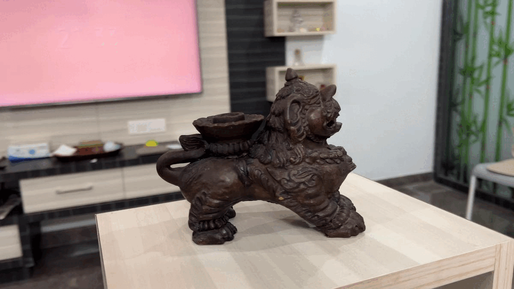

# OSA Video2Object

Video2Object is an open source repository that contains Python code for converting videos to 3D objects using various Open Source Algorithms(OSA).
## Build instructions and Installation
To use Video2Object, you must first install the required dependencies:

### Step 1 for Linux:
##### Required tools:
- CMake
- Git
- C/C++ compiler (GCC, Visual Studio or Clang)

##### As OpenMVG & OpenMVS uses some C++11 features, you must have a C++11 ready compiler:

- Visual Studio >= 2015 (recommended)
- GCC >= 4.8.1
- Clang >= 3.3

```bash
   sudo sh build.sh
```
### Step 1 for Windows:

Please download the prebuilt files from the below link for OpenMVG and OpenMVS
- [OpenMVG Binary Files](https://github.com/openMVG/openMVG/releases/tag/v2.0)
- [OpenMVS Binary Files](https://github.com/cdcseacave/openMVS/releases/tag/v2.1.0)
Download them and place it in scripts/WinLibs/OpenMVG and OpenMVS respectively


### Step 2:
Install the Python requiremts
```python
   pip install -r requirements.txt
```

    
## Usage

The repository contains Python scripts for each of the implemented algorithms. To convert a video to a 3D object using a specific algorithm, simply run the corresponding script. The output 3D object file will be saved in the same directory as the input video file.

```bash
  python video2object.py -i data/example.MOV -p HIGH
```
## Example

### Here is the Result


## License

[MIT](https://choosealicense.com/licenses/mit/)